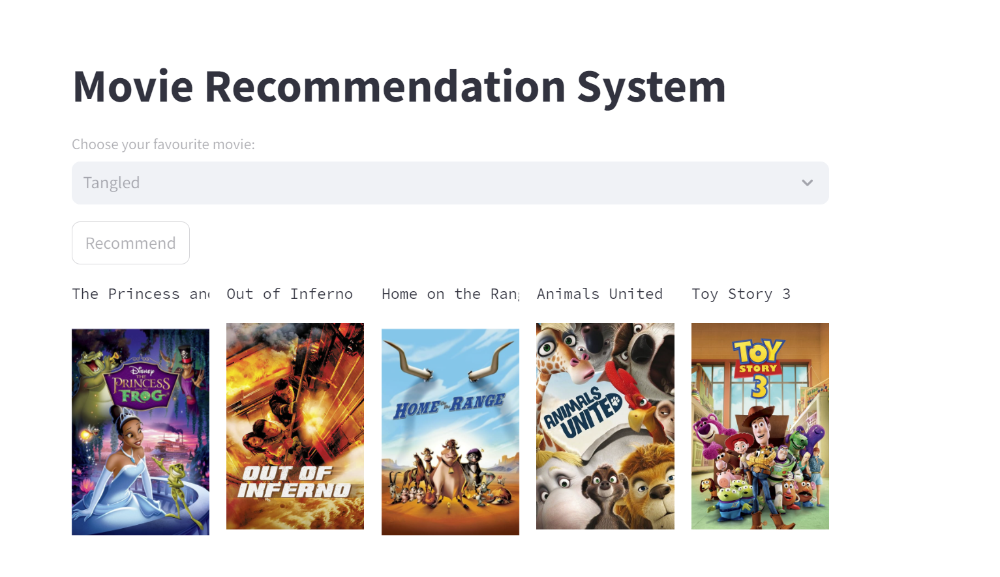

# Movie Recommendation System
A content-based movie recommendation system using cosine similarity to suggest movies based on user preferences.

Workflow
```Data → Pre-processing → ML Model → Website and Deployment```



Dataset
The dataset is sourced from TMDb. It contains information about movies such as title, genres, keywords, cast, and crew.


### Technologies Used
```Python```

```Pandas``` for data manipulation

```Pickle``` for storing the processed data

```Scikit-learn``` for cosine similarity calculation
 Vectorization of Data is done. 
